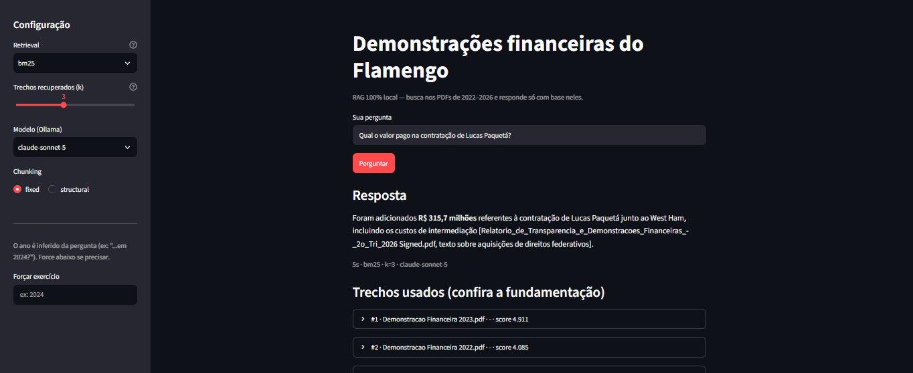
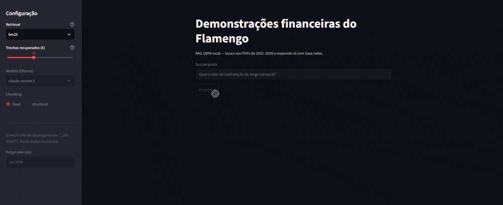

# finance-notes-rag

Pipeline RAG **100% local, custo de nuvem US$ 0**, que responde perguntas em
linguagem natural sobre as **demonstrações financeiras do Clube de Regatas do
Flamengo** (exercícios de 2022 a 2025 + Relatório de Transparência do 2º
trimestre de 2026).

Você pergunta _"qual foi a receita operacional líquida em 2023?"_ e o sistema
busca nos PDFs, recupera os trechos relevantes e o LLM redige a resposta —
**fundamentada só nos documentos**, com citação da fonte, e admitindo quando a
informação não está lá.

```
$ python -m src.rag "qual foi o total do ativo em 2023?"
R$ 1.389.902 mil [Demonstração Financeira 2023.pdf, Balanço patrimonial]
```

## Interface



Além da resposta, a interface mostra **os trechos que o modelo usou**, para
conferir se a resposta está ancorada no documento.



## Por que este projeto

- **Problema real:** demonstrações financeiras são densas, cheias de tabelas, e
  algumas só existem como PDF escaneado. Consultar um número específico exige
  garimpo manual.
- **Custo zero:** OCR, embeddings, banco vetorial e LLM rodam na própria
  máquina (uma ultrabook com CPU i5-8265U, sem GPU utilizável). Nenhuma chave de
  API. Consciência de custo importa.
- **Decisões medidas, não supostas:** cada escolha de arquitetura (modo de
  busca, estratégia de chunking, linearização de tabela) foi testada contra um
  conjunto de avaliação e mantida ou descartada pelos números.

## Resultados

20 perguntas de teste (`data/eval/questions.jsonl`), gabarito verificado nos
documentos. Config final: **chunking fixo + BM25 + ano inferido da pergunta +
`llama3.2:3b`**, tudo local.

| retrieval hit@k | MRR  | resposta correta | abstenção correta |
| --------------- | ---- | ---------------- | ----------------- |
| 82%             | 0,75 | 65%              | 100%              |

- **retrieval hit@k** — o trecho com a resposta está entre os `k` recuperados.
- **resposta correta** — a resposta gerada contém o valor/termo esperado.
- **abstenção correta** — nas 3 perguntas sem resposta nos documentos, o sistema
  respondeu "não encontrei" (nunca inventou).

O que a avaliação decidiu (detalhes em [docs/avaliacao.md](docs/avaliacao.md)):

| Decisão                                | Resultado medido                                                                               |
| -------------------------------------- | ---------------------------------------------------------------------------------------------- |
| BM25 lexical vs. busca híbrida         | BM25 **+24 pontos** — o embedding multilíngue pequeno é grosseiro demais para termos contábeis |
| Inferir o ano da pergunta e filtrar    | recupera tanto quanto o filtro manual (88%)                                                    |
| Chunking de tamanho fixo vs. por seção | fixo **+6 pontos** — blocos uniformes ajudam o modelo pequeno                                  |
| Linearizar tabelas em frases           | **−30 pontos** — inundou o índice; revertido                                                   |

O gargalo restante é o LLM de 3B lendo tabela (pega sub-linha em vez do total, ou
a coluna "consolidado" em vez de "controladora"). O retrieval já está perto do teto.

## Arquitetura

Ver [docs/arquitetura.md](docs/arquitetura.md).

```
                        INDEXAÇÃO (offline)                    CONSULTA (online)
  data/raw_docs/*.pdf                                   pergunta
        │                                                  │
        ▼  pymupdf4llm  /  OCR (Tesseract-por)             ▼  guess_year()
  data/extracted/*.md                                  filtro doc_year
        │                                                  │
        ▼  clean.py (limpeza, ~7 regras)                   ▼  BM25 (stemmer PT)
  data/clean/*.md                                      top-k chunks
        │                                                  │
        ▼  chunking (SentenceSplitter 512/64)              ▼  monta prompt + contexto
  data/chunks/fixed.jsonl                                   │
        │                                                  ▼  Ollama · llama3.2:3b
        ▼  MiniLM multilíngue (fastembed/ONNX)          resposta citada
  ChromaDB (chroma_db/, cosseno)
```

| Camada       | Ferramenta                                                                 | Por quê                                                                    |
| ------------ | -------------------------------------------------------------------------- | -------------------------------------------------------------------------- |
| Framework    | LlamaIndex                                                                 | data-first, integra tudo                                                   |
| Extração PDF | pymupdf4llm + Tesseract-`por`                                              | tabelas viram markdown; OCR local para os PDFs escaneados de 2024/2025     |
| Embeddings   | `paraphrase-multilingual-MiniLM-L12-v2` (ONNX)                             | ~0,3 s/chunk em CPU; BGE-M3 seria melhor mas leva ~7 s/chunk nesta máquina |
| Vector DB    | ChromaDB (cosseno)                                                         | embutido, sem servidor                                                     |
| Retrieval    | BM25 (`bm25s`) + filtro de metadado                                        | venceu a busca semântica na avaliação                                      |
| LLM          | Ollama · `llama3.2:3b` (padrão) · `qwen2.5:7b` · Claude via API (opcional) | local e grátis por padrão; Claude é a válvula de escape para qualidade     |
| Avaliação    | script próprio determinístico                                              | resposta = número; matching direto é mais confiável que juiz LLM fraco     |

## Estrutura

```
src/
  ingest.py        Etapas 1–2: carregar PDF (ou OCR) + limpar + chunking
  ocr.py           OCR dos PDFs sem camada de texto (2024, 2025)
  clean.py         limpeza do markdown extraído (letras espaçadas, cabeçalhos, etc.)
  tables.py        linearização de tabelas — experimento (piorou, opt-in)
  embed_index.py   Etapas 3–4: embeddings + indexação no ChromaDB
  query.py         Etapa 5: retrieval (vector / bm25 / hybrid), sem LLM
  rag.py           Etapa 6: pipeline completo, retrieval + geração
  evaluate.py      Etapa 7: avaliação sobre data/eval/questions.jsonl
  ragas_eval.py    RAGAS (venv separado — conflito de dependências)
app/streamlit_app.py   interface de chat
docs/avaliacao.md      análise completa dos resultados
data/eval/questions.jsonl   conjunto de teste (versionado)
```

## Como rodar

### Pré-requisitos

```bash
python -m venv .venv
.venv\Scripts\activate                 # Windows
pip install -r requirements.txt

# OCR (para 2024/2025):
winget install UB-Mannheim.TesseractOCR
curl -L -o models/tessdata/por.traineddata \
  https://github.com/tesseract-ocr/tessdata_best/raw/main/por.traineddata

# LLM local:
winget install Ollama.Ollama
ollama pull llama3.2:3b
```

Coloque os PDFs em `data/raw_docs/` (ou use o excerto em `data/sample_docs/`).

### Pipeline

```bash
python -m src.ingest --source data/raw_docs        # extrai + limpa + chunking
python -m src.embed_index --rebuild                # indexa no ChromaDB
python -m src.rag "qual foi o superávit em 2023?"  # pergunta
streamlit run app/streamlit_app.py                 # ou pela interface
```

### Avaliação

```bash
python -m src.evaluate                 # roda as 20 perguntas + métricas
python -m src.evaluate --report-only   # recalcula do cache, sem LLM
```

## Limitações conhecidas

- **Hardware:** CPU sem GPU utilizável. Resposta em ~40–70 s (`llama3.2:3b`).
- **Leitura de tabela:** o `llama3.2:3b` erra ~1/3 das perguntas cujo valor está
  numa tabela grande (pega a sub-linha ou a coluna errada, e às vezes confabula
  o que "está incluído"). `qwen2.5:7b` (seletor da interface) sobe para 71% de
  acerto, ao custo de ~2,5 min/resposta. Sempre confira o número no trecho
  exibido abaixo da resposta.
- **Claude via API (opcional, pago, não-local):** `claude-sonnet-5` acerta 76%
  (vs 65% do `llama3.2:3b`), ~20× mais rápido, ~US$ 0,005/pergunta. Coloque
  `ANTHROPIC_API_KEY` no `.env` (ver `.env.example`) e os modelos `claude-*`
  aparecem no seletor. Só a geração vai para a nuvem — extração, embeddings e
  índice continuam locais.
- **Retrieval do balanço:** "total do ativo" é uma expressão genérica; o chunk
  do balanço entra no top-3 só ~40% das vezes. É o gargalo atual — nenhum
  modelo de geração conserta isso.
- **OCR:** as tabelas de 2024/2025 vêm de OCR; o alinhamento de colunas é
  aproximado.
- **RAGAS:** exige `langchain 0.2.x` (fixa `numpy<2`), incompatível com o resto
  do stack. Roda só em ambiente isolado.

## Licença

MIT — ver [LICENSE](LICENSE).
