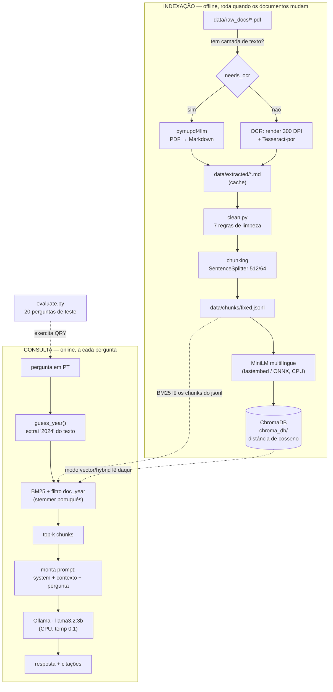

# Arquitetura

## Visão geral

O pipeline tem duas fases que rodam em momentos diferentes.



## Por que cada peça

| Decisão | Alternativa considerada | Por que esta |
|---|---|---|
| **BM25** como retrieval padrão | busca semântica / híbrida | Na avaliação, BM25 + filtro de ano acertou 65% vs. 35% do híbrido. O embedding multilíngue pequeno (384 dims) não distingue bem termos contábeis exatos, e a fusão RRF diluía o bom ranking do BM25. |
| **Chunking de tamanho fixo** (512 tokens) | chunking por seção/título | Fixo acertou 65% vs. 59% do estrutural. Chunks estruturais são muito desiguais (tabela de 1000 tokens ao lado de fragmento de título); blocos uniformes ajudam o modelo de 3B. |
| **MiniLM via ONNX** | BGE-M3 (o "melhor" modelo) | BGE-M3 leva ~7 s por chunk nesta CPU (e ~7 s por pergunta). MiniLM: ~0,3 s. Para deploy local em CPU, o modelo eficiente é a escolha certa. |
| **`llama3.2:3b`** | `llama3.2:1b` / `qwen2.5:7b` | 1B é rápido mas desiste ("não encontrei") mesmo com o contexto certo. 7B leria melhor a tabela, mas ~2 min/resposta. 3B é o equilíbrio. |
| **Filtro por `doc_year`** inferido da pergunta | deixar a semântica resolver o ano | "em 2024" é um filtro, não semântica. Inferir e filtrar recupera 88% vs. 71% sem filtro. |
| **Avaliação determinística** | RAGAS | A resposta é um número — matching direto (com normalização) é reproduzível e grátis. RAGAS precisaria de um juiz LLM forte (não-local). |

## Metadados que viajam com cada chunk

- `source` — nome do arquivo, para citar a fonte
- `doc_year` — exercício principal do documento (extraído do nome), para o filtro
- `header_path` — caminho de seções (chunking estrutural), para contexto

## Fluxo de dados no disco

```
data/raw_docs/*.pdf        (não versionado — documentos do usuário)
  → data/extracted/*.md    (cache da extração/OCR — lento só na 1ª vez)
  → data/clean/*.md        (pós-limpeza — inspecionável)
  → data/chunks/*.jsonl    (chunks + metadados + contagem de tokens)
  → chroma_db/             (índice vetorial persistido)
data/eval/questions.jsonl  (versionado — conjunto de teste)
  → data/eval/runs/*.jsonl (cache das respostas por configuração)
```
